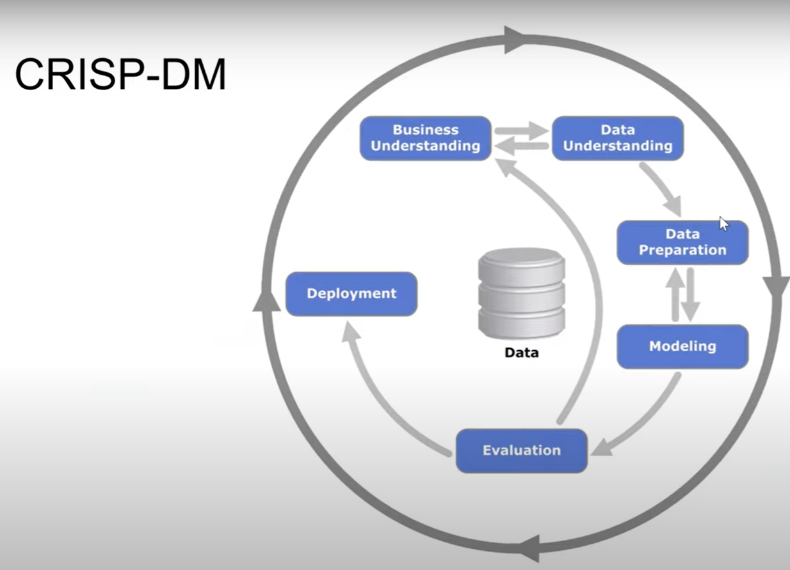

# Week 1

## 1.1 [Introduction to Machine Learning](https://github.com/DataTalksClub/machine-learning-zoomcamp/blob/master/01-intro/01-what-is-ml.md)

- Example: recommending a price for a car, given its properties such as: age, mileage, model, no. of doors, etc.
- Patterns can be found in the data which can be modelled
- Essence of ML: given data, have a model learn patterns in the data
- Data consists of:
    - Features: what we know about cars (i.e. its properties)
    - Target: what we want to predict (i.e. its price)
- User can provide information on a car they want to sell. This data is extracted. Price (target) is predicted and suggested to the user as an appropriate price.

## 1.2 [ML vs Rule-Based Systems](https://github.com/DataTalksClub/machine-learning-zoomcamp/blob/master/01-intro/02-ml-vs-rules.md)

This lesson will cover a comparison between rule-based and ML systems. The example used is an e-mail spam detection system.

We want to develop a spam detection system using a classifier.

One approach is to take all the spam messages and try to identify what makes a message spam. We could come up with explicit rules based on the sender, subject, etc. However spam messages evolve and require frequent updates, leading inevitably to a myriad of rules and logic which will be a nightmare to maintain.

Alternatively, we can use Machine Learning. How do we do this? We get the data (all the e-mails), define and calculate features, train and use the model.
- Getting the data: we could have a spam button which users can press to indicate an e-mail is spam
- Defining features: we could start off with some rules, e.g. length of subject greater than 10, length of body greater than 10, sender has a certain domain, sender e-mail address has a certain pattern, and so on. These are just some examples of features, there can be more/different ones. Then for a given e-mail, we can put its data in a vector: $[1, 1, 0, 0, 1, 1]$, This would indicate then the length of the subject is greater than 10, length of body is greater than 10, etc. Say that the user designated this e-mail as spam, then the target variable is also $1$. We do this for many e-mails and get a matrix with the features and a vector with target variables.
- Train model: features and target variables go into ML model. We fit/train the model and determine some unknown coefficients that minimize the error between predictions and the target.
- Use model: now that the model has been trained, we can put new data into it and predict the target. 

## 1.3 [Supervised Machine Learning](https://github.com/DataTalksClub/machine-learning-zoomcamp/blob/master/01-intro/03-supervised-ml.md)

In the cars example in [1.1](#11-introduction-to-machine-learning) we provided the data and the target variable and the ML model learns the patterns in the data. These patterns can than be used to generalize to new samples. In e-mail spam example in [1.2](#12-ml-vs-rule-based-systems), we did exactly the same. When the target variable is given, this is known as _Supervised Machine Learning_.

The _feature matrix_ is a twodimensional array in which the rows are our observations or _samples_ and the columns are _features_. It is designated with $\mathbf{X}$. The _target_ is a vector designated with $\mathbf{y}$. $\mathbf{X}$ is our input and $\mathbf{y}$ is our output.

If we have a model g:
$$
g(\mathbf{X}) \approx \mathbf{y}
$$

For _regression_ (car price prediction), we predict the price of a car. $\mathbf{g}$ outputs a price.

For _classification_ (spam classification), we predict the probability of an e-mail being spam. $\mathbf{g}$ outputs a 1 or 0 (whether it is spam or not).

For _classification_, besides _binary classification_ (spam or not spam) there can also be _multi-class classification_, where we are predicting a category out of more than 2 categories (e.g. cat, bird, dog, horse, etc.)

_Ranking_ orders a list for your you by providing scores for each item. Recommender systems are based on this.

## 1.4 [CRISP-DM](https://github.com/DataTalksClub/machine-learning-zoomcamp/blob/master/01-intro/04-crisp-dm.md)

_CRISP-DM_ is a methodology for organizing ML projects. It stands for Cross-Industry Standard Processing Data Mining. There are 6 steps.



ML Project: understand the problem, collect the data, train the model, use it.

We will use the spam detection example.

E-mail &rarr; Model &rarr; spam / not spam.

### Step 1: Business Understanding

Goal is to identify the problem to solve. Understand if problem is important and how to measure success. Here we decide whether we need ML.

Spam detection: users complain about spam. What is the extent of the problem? One users or many? Do we need ML? Define the goal: e.g. reduce amount of spam messages, reduce amount of complaints about spam. Goal should be measurable: reduce amount of spam messages by 50%.

### Step 2: Data Understanding

Make sure data is available, or what is missing, and how to collect/acquire it. 

Spam detection: spam button. Is the data behind this button good enough? Is it reliable? Do we track it correctly? Is the dataset large enough? Do we need to get more data?

### Step 3: Data Preparation

The data needs to be transformed such that it can be used in the ML model. We may need to clean the data, extract features, build pipelines, convert into tabular form.

### Step 4: Modeling

We now have the data in the right format. We try different models and we pick the best one. For example logistic regression, decision tree, neural network, etc. We may need to go back to data preparation to fix issues with the data or do more feature engineering.

### Step 5: Evaluation

Now we will assess how well the model is performing with respect to the goal we defines under Business Understanding. Have we reached the goal? Do our metrics improve? Did we solve/measure the right thing? Was the goal achievable? Do we need to update the goal?

### Step 6: Deployment

This step goes hand in hand with Evaluation. We deploy the model and monitor it when online. Usually we first deploy to a subset of users. 

This process is typically iterated over based on learnings.

It is a good idea to start simple and go quickly through all the steps. Then you iterate to introduce further improvements.

## 1.5 [The Modeling Step (Model Selection Process)](https://github.com/DataTalksClub/machine-learning-zoomcamp/blob/master/01-intro/05-model-selection.md)


## 1.6 [Setting up the Environment](https://github.com/DataTalksClub/machine-learning-zoomcamp/blob/master/01-intro/06-environment.md)

I am using WSL2. 

I created a conda environment:

```bash
conda create -n ml-zoomcamp python=3.10
```

Then I activated it:

```bash
conda activate ml-zoomcamp
```

Subsequently I installed these libraries:

```bash
conda install numpy pandas scikit-learn seaborn jupyter
```

I had to install the VS Code Jupyter extension in WSL2.


## 1.7 [Introduction to NumPy](https://github.com/DataTalksClub/machine-learning-zoomcamp/blob/master/01-intro/07-numpy.md)

Check the [Jupyter notebook](1_7_introduction_to_numpy.ipynb).


## 1.8 [Linear Algebra Refresher](https://github.com/DataTalksClub/machine-learning-zoomcamp/blob/master/01-intro/08-linear-algebra.md)


## 1.9 [Introduction to Pandas](https://github.com/DataTalksClub/machine-learning-zoomcamp/blob/master/01-intro/09-pandas.md)


## 1.10 [Summary](https://github.com/DataTalksClub/machine-learning-zoomcamp/blob/master/01-intro/10-summary.md)


## 1.11 [Homework](https://github.com/DataTalksClub/machine-learning-zoomcamp/blob/master/01-intro/homework.md)


